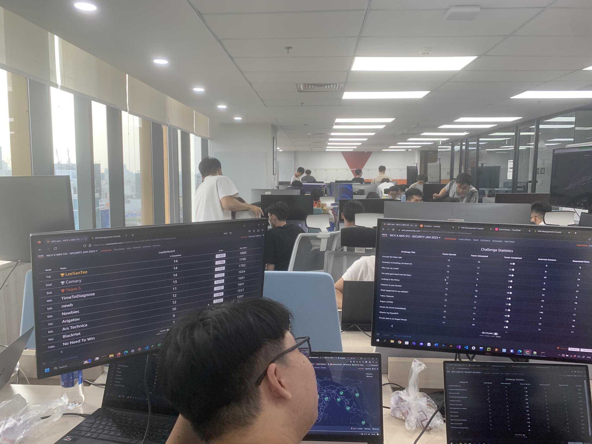
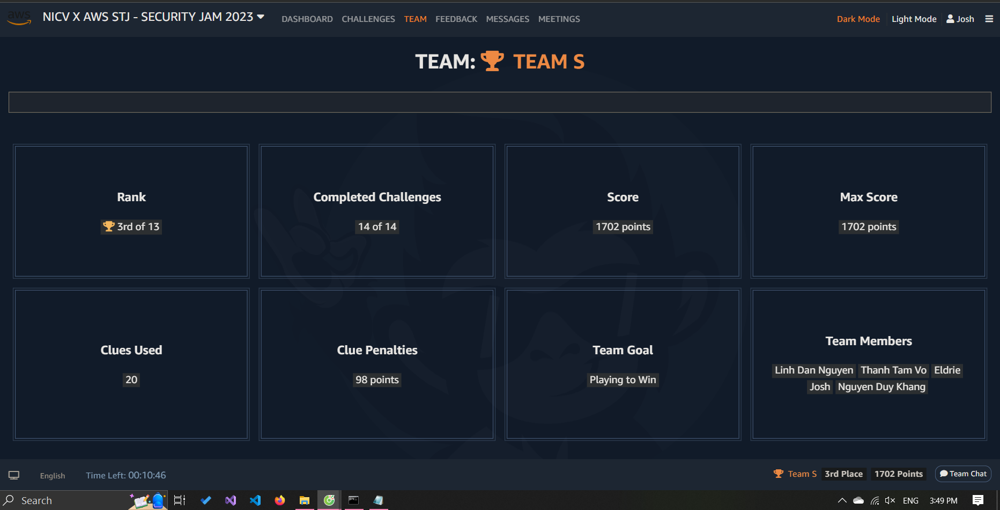
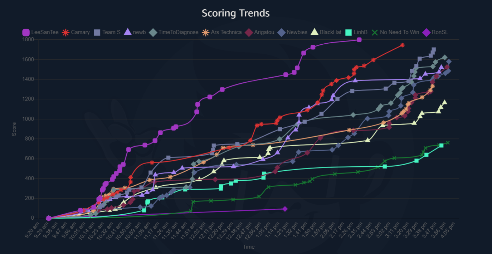
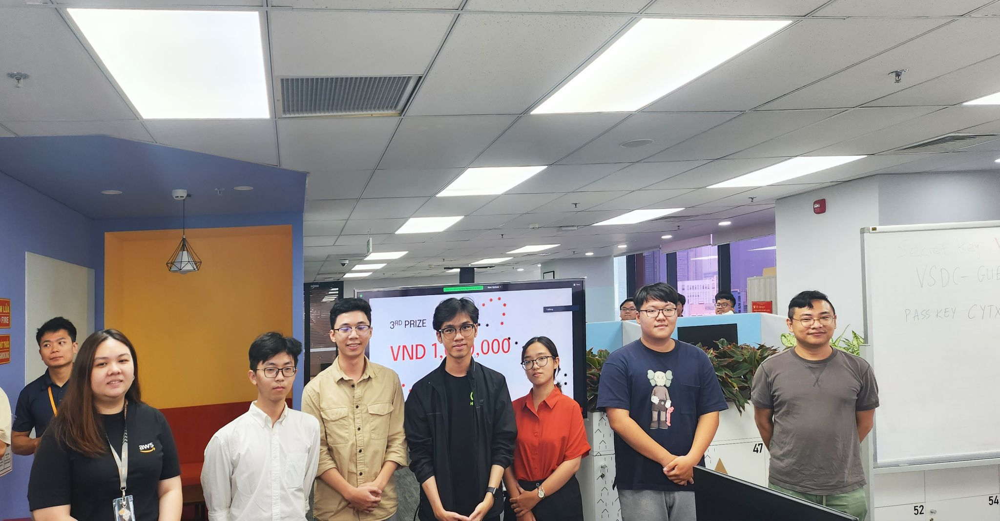

# My Day at the AWS Security JAM 

Greetings! I'm Luan.

Cyber security enthusiast and sophomore at Swinburne University of Technology

https://www.linkedin.com/in/viluandang/

# Why did we participate in this competition

After finishing a cloud computing course in Swinburne University, which is COS20019 - Cloud Computing, we want to test our knowledge in this domain, therefore, a group of 5 students from Swinburne Vietnam has join this competition!

# How was the competition

There were 3 categories - Easy, Medium, and Hard. The challenge statements were long and in most cases needed thorough reading and re-reading. Each challenge had 3 clues. There were penalties (point deductions) associated with using the clues. There was a separate AWS Console/CLI environment for each of the 10 challenges.

I was sweating even the easy ones, mainly because I was overcomplicating them. The hard ones were really difficult and I could not have solved them without the clues. In the end, I didn't know how the six hours vanished. The security JAM was one of the most engaging and exciting contests that I have been part of.

Here are our team stats from the JAM;

Despite the hardship, our team did get a third prize from this competion, which is not the best achievement but certainly will not be our last!

